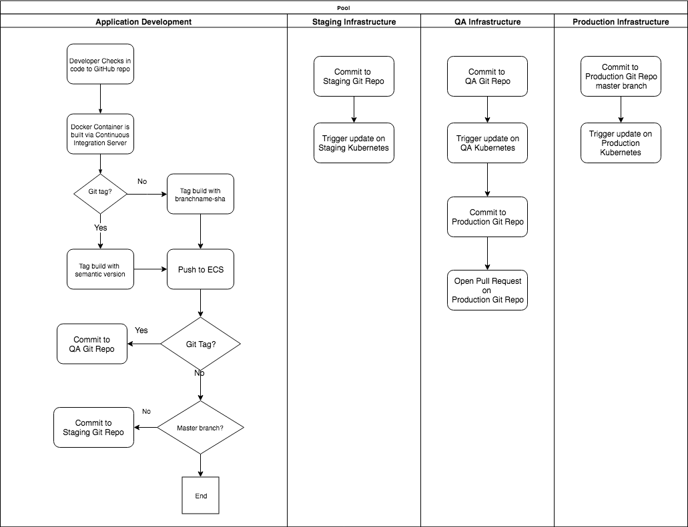

# The Deployment Pipeline

The heavy lifting of the deployment pipeline is done by [Drone CI](https://drone.io/) and [Kubernetes](https://cloud.google.com/kubernetes-engine).

Take a moment to study the Drone CI build config files (`.drone.yml`) across the various GitHub repositories to get a sense of how the pipeline fits together:

* [pipeline-application](https://github.com/dellintosh/pipeline-application)
* [pipeline-application-infra-staging](https://github.com/dellintosh/pipeline-application-infra-staging)
* [pipeline-application-infra-qa](https://github.com/dellintosh/pipeline-application-infra-qa)
* [pipeline-application-infra-production](https://github.com/dellintosh/pipeline-application-infra-production)

## High Level Diagram

## High Level Text Description

 * changes pushed to any branch, except the master branch, on the [pipeline application](https://github.com/dellintosh/pipeline-application) repo will trigger a container build and a git commit to the [pipeline-application-infra-staging](https://github.com/dellintosh/pipeline-application-infra-staging) repo, which updates the pipeline deployment Kubernetes configuration file with the new container image.
 * changes pushed to the [pipeline-application-infra-staging](https://github.com/dellintosh/pipeline-application-infra-staging) repo will trigger a rolling deployment to a Kubernetes staging cluster.
 * tags on the [pipeline application](https://github.com/dellintosh/pipeline-application) repo will trigger a container build based on the tag name and a git commit to the [pipeline-application-infra-qa](https://github.com/dellintosh/pipeline-application-infra-qa) repo, which updates the pipeline deployment Kubernetes configuration file with the new container image.
 * changes pushed to the [pipeline-application-infra-qa](https://github.com/dellintosh/pipeline-application-infra-qa) repo will trigger a rolling deployment to a Kubernetes QA cluster.
 * successful deployments to QA will trigger a pull request on the [pipeline-application-infra-production](https://github.com/dellintosh/pipeline-application-infra-production) repo.
 * changes pushed to the master branch on the [pipeline-application-infra-production](https://github.com/dellintosh/pipeline-application-infra-production) repo will trigger a rolling deployment to a Kubernetes production cluster.

 > The rolling update to the production cluster is gated by a pull request to the `pipeline-application-infra-production` repo.
