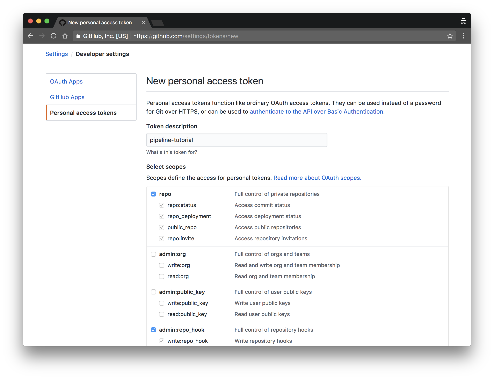

# Prerequisites

In this section you will set up the necessary services and client tools required to complete this tutorial.

## Services

The following services are required to complete this tutorial:

* [GitHub](https://github.com)
* [Drone CI](https://drone.io)

You will also need a hosting provider, the examples shown are based on [Amazon AWS](https://aws.amazon.com), but you can use a different provider.

## Install the Client Tools

The following client tools are required to complete this tutorial:

 * [hub](https://github.com/github/hub) 2.3.0+
 * [hub-credential-helper](https://github.com/kelseyhightower/hub-credential-helper) 0.0.1+
 * [git](https://git-scm.com/downloads) 2.14.0+
 * [aws](https://aws.amazon.com/cli/) 1.11+
 * [kops](https://github.com/kubernetes/kops) 1.8.1+
 * [kubectl](https://github.com/kubernetes/kubernetes/blob/master/CHANGELOG-1.8.md#downloads-for-v183) 1.8.0+
 * [drone-cli](http://docs.drone.io/cli-installation/) 0.8.6+

## Generate a GitHub API Token

In this section you will generate a [GitHub API Token](https://github.com/blog/1509-personal-api-tokens) which will be used to automate the GitHub related tasks throughout this tutorial.

Generate a GitHub token using the official [guide](https://github.com/blog/1509-personal-api-tokens). While creating the token, set the token description to "pipeline-tutorial", and check the `repo` and `admin:repo_hook` scopes.



Write the token to the `.pipeline-tutorial-github-api-token` file in the current directory:

```
echo -n "<token>" > .pipeline-tutorial-github-api-token
```

Your GitHub username will be used to automate GitHub related tasks including forking the GitHub repositories necessary to complete this tutorial and creating [GitHub webhooks](https://developer.github.com/webhooks/). Save your GitHub username in the `GITHUB_USERNAME` env var:

```
export GITHUB_USERNAME="<github-username>"
```

Next: [Provision the Kubernetes Clusters](kubernetes-clusters.md)