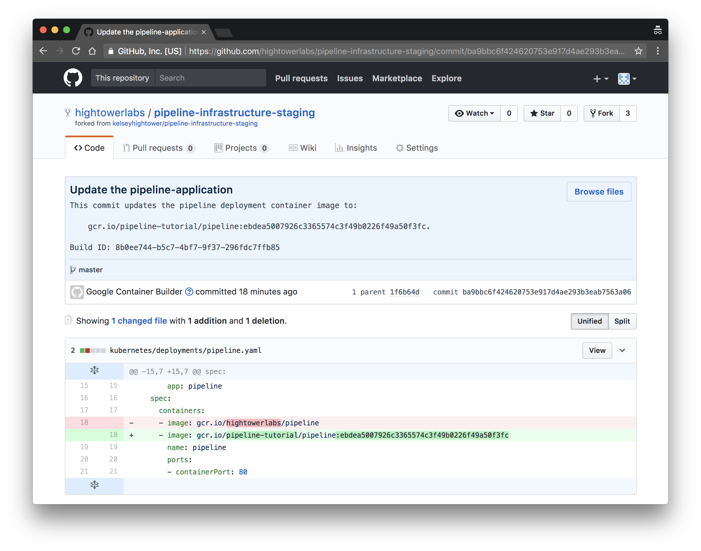
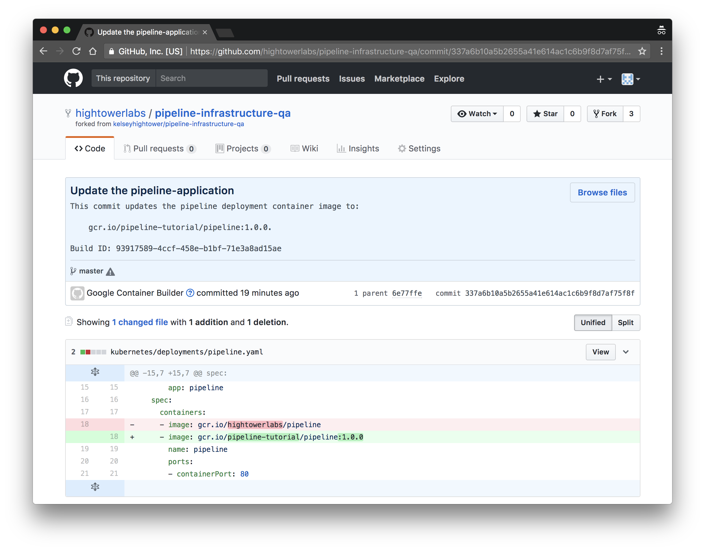
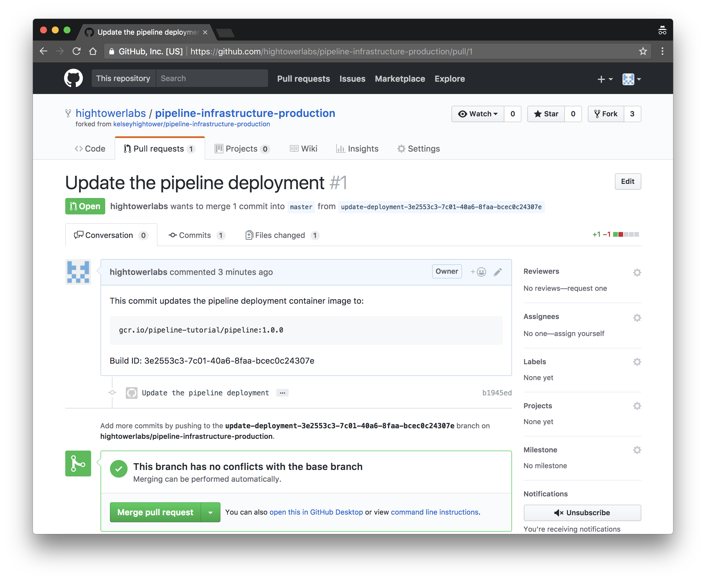

# Test the Pipeline

In this section you will test the Drone CI build pipeline by making modifications to the pipeline application and observing how each change propogates through the staging, qa, and production environments.

## Retrieve the Kubernetes cluster pods

Set the list of environments:

```
ENVIRONMENTS=(
  staging
  qa
  production
)
```

Verify no pods are currently running in any environment:
```
for e in ${ENVIRONMENTS[@]}; do
  kubectl get pods --context ${e}
done
```

## Modify the Pipeline Application

In this section you will modify the pipeline application and push the changes to a new branch on your pipeline-application GitHub repository.

Configure git to ensure the hub command line utility uses the HTTPS protocol when working with GitHub repositories:

```
git config --global hub.protocol https
```

Configure a git credential helper to use the `hub-credential-helper` utility when authenticating to GitHub:

```
git config --global credential.https://github.com.helper /usr/local/bin/hub-credential-helper
```

Clone the `pipeline-application` GitHub repository to the current directory:

```
hub clone ${GITHUB_USERNAME}/pipeline-application
```

Change into the `pipeline-application` directory and create a new branch named `new-message`:

```
cd pipeline-application
```

```
git checkout -b new-message
```

Modify the message return for HTTP requests to the pipeline application:

```
sed "s/world/${GITHUB_USERNAME}/g" main.go > main.go.new
```

```
mv main.go.new main.go
```

> The syntax for in-place sed updates does not work consistently across operating systems so we are forced to create a temporary file and use it to overwrite the target of our changes.

Review the changes to the pipeline application:

```
git diff
```
```
diff --git a/main.go b/main.go
index 2f76589..0b08a59 100644
--- a/main.go
+++ b/main.go
@@ -21,7 +21,7 @@ func main() {
        log.Println("Starting pipeline application...")

        http.HandleFunc("/", func(w http.ResponseWriter, r *http.Request) {
-               fmt.Fprintf(w, "Hello world!\n")
+               fmt.Fprintf(w, "Hello dellintosh!\n")
        })

        http.HandleFunc("/health", func(w http.ResponseWriter, r *http.Request) {
```

Commit the changes and push the `new-message` branch to the `pipeline-application` GitHub repository:

```
git add main.go && git commit -m "change message" && git push origin new-message
```

Review the current builds:

```
drone build last ${GITHUB_USERNAME}/pipeline-application
for e in ${ENVIRONMENTS[@]}; do
  drone build last ${GITHUB_USERNAME}/pipeline-application-infra-${e}
done
```

You can also view the build history using the Drone CI Console:


Pushing a new branch to the `pipeline-application` GitHub repository will trigger the `staging-build` pipeline, which will in turn trigger the `staging-infra` build:

The `staging-infra` build step pushes a commit to the `pipeline-application-infra-staging` GitHub repository.



List the pods created by the `staging-deployment` build trigger:

```
kubectl get pods \
  --context staging
```
```
NAME                                   READY     STATUS    RESTARTS   AGE
pipeline-application-389525417-68nxn   1/1       Running   0          1m
```

Verify the changes:

```
SERVICE_IP_ADDRESS=$(kubectl get svc pipeline-application \
  --context staging \
  -o jsonpath="{.status.loadBalancer.ingress[0].ip}")
```

```
curl http://${SERVICE_IP_ADDRESS}
```

## Tag the pipeline-application Repo

In this section you will merge the `new-message` and `master` branches, then create a new tag on the `pipeline-application` GitHub repository, which will trigger a new pipeline container image to be built and deployed to the QA Kubernetes cluster.

Checkout the master branch:

```
git checkout master
```

Merge the `new-message` and `master` branches and push the changes to the `pipeline-applicaiton` GitHub repository:

```
git merge new-message && git push origin master
```

Create a new `v1.0.0` tag and push it to the `pipeline-applicaiton` GitHub repository:

```
git tag v1.0.0 && git push origin --tags
```

Pushing a new tag to the `pipeline-applicaiton` GitHub repository will trigger the `qa-build` build trigger, which will in turn trigger the `qa-infra` build.

The `qa-infra` build step pushes a commit to the `pipeline-application-infra-qa` GitHub repository.



Review the current builds:

> Notice a new Docker image was created based on the `v1.0.0` tag pushed to the `pipeline-application` GitHub repository.

List the pods created by the `qa-deployment` build trigger:

```
kubectl get pods \
  --context qa
```

```
NAME                                   READY     STATUS    RESTARTS   AGE
pipeline-application-685432654-h4zhc   1/1       Running   0          1m
```

Hit the pipeline application in the QA cluster:

```
SERVICE_IP_ADDRESS=$(kubectl get svc pipeline-application \
  --context qa \
  -o jsonpath="{.status.loadBalancer.ingress[0].ip}")
```

```
curl http://${SERVICE_IP_ADDRESS}
```

Once the pipeline application is deployed to the QA cluster a pull request is sent to the `pipeline-application-infra-production` GitHub repository. Review and merge the PR on GitHub:



Merging the pull-request on the `pipeline-application-infra-production` GitHub repository will trigger the `production-deployment` build trigger.

List the pods created by the `production-deployment` build trigger:

```
kubectl get pods \
  --context production
```

```
NAME                                   READY     STATUS    RESTARTS   AGE
pipeline-application-685432654-gndw1   1/1       Running   0          35s
```

Hit the pipeline application in the production cluster:

```
SERVICE_IP_ADDRESS=$(kubectl get svc pipeline-application \
  --context production \
  -o jsonpath="{.status.loadBalancer.ingress[0].ip}")
```

```
curl http://${SERVICE_IP_ADDRESS}
```

At this point the `pipeline-application:v1.0.0` container image has been propagated across each environment and is now running in the production Kubernetes cluster.

